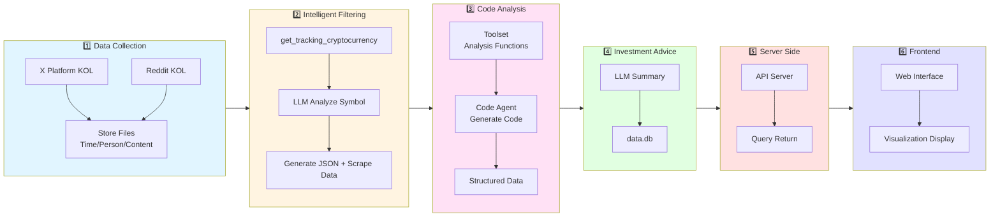

AI Crypto Advisor — LLM‑Driven Trend Analysis and Investment Advice

Overview
- An end‑to‑end pipeline that analyzes social media signals, market data, on‑chain metrics, and developer activity to produce structured investment advice for cryptocurrencies.
- Advice is generated with an LLM and persisted to a local SQLite database, exposed via a lightweight HTTP server and consumed by a React frontend.

Key Features
- Social media analysis: Extracts KOL sentiment from `Data.pdf` and produces a focus symbol with rationale.
- Market data aggregation: Fetches 24h OHLCV + indicators per tracked symbol via `spoon-toolkits` (with ccxt fallback when available).
- Technical metrics: Builds high‑value predictive indicators (RSI, MACD hist, ATR, VWAP deviation, CMF, CHOP, regression outlier, OBV).
- On‑chain + dev simulators: Mock 24h datasets for network and development activity to support analysis during early stages.
- LLM summary: Synthesizes signals into a structured “buy/hold/sell” advice and stores it in `data.db`.
- Backend API: `GET /api/get_last_10_advises` returns the latest 10 advises.
- Frontend app: React + Vite UI that periodically fetches and displays the latest advice.

Architecture
- `service/social_media_analyzer.py`
  - Reads `Data.pdf` and uses OpenAI Chat Completions to select the symbol that requires the most attention.
  - Writes the result to `CODE_GEN/resources/social_media_analysis.txt`.
- `service/cryptocurrency_service.py`
  - `save_tracking_symbols_to_resources()` fetches 24h market data for tracked symbols and saves JSON to `CODE_GEN/resources/{symbol}.txt`.
  - Uses `spoon-toolkits` when available; falls back to `ccxt` for real CEX data.
- Analysis functions (under `CODE_GEN/`):
  - `technical_metrics_builder.market_data_analysis(symbol)`
  - `development_process.dev_data_analysis(symbol)`
  - `onchain_process.chain_data_analysis(symbol)`
- Advice generation: `CODE_GEN/final_analysis.llm_summary(symbol, analysis_results)`
  - Loads social media + 24h symbol resource, calls `langchain-openai` `ChatOpenAI` (model name set to `gpt-5` in code), validates output, and inserts into SQLite `advises`.
- HTTP API: `server.py` exposes `GET /api/get_last_10_advises` backed by `service/db_service.get_last_10_advises()`.
- Frontend: `frontend/` consumes the API and renders latest advices; update the backend URL in `frontend/src/lib/api.ts` if needed.

Flow Diagram

Repository Layout
- `service/` — social media analyzer, market data tools, DB access.
- `CODE_GEN/` — analysis functions, orchestration entrypoints, resources, prompts.
- `frontend/` — React + Vite client consuming the backend API.
- `data.db` — SQLite database storing generated investment advice in table `advises`.

Prerequisites
- Python 3.10+
- Node.js 18+ for the frontend
- OpenAI API key for LLM features
- Optional: ccxt for CEX data fallback

Python Setup
1. Create a virtual environment and install dependencies:
   - `python -m venv .venv && source .venv/bin/activate`
   - `pip install -r requirements.txt`
     - Note: `os` and `re` are part of Python’s standard library and typically should not be installed from PyPI. If installation fails, remove those lines before installing.
2. Set environment variables (example):
   - `export OPENAI_API_KEY="sk-..."`
   - `export OPENAI_MODEL="gpt-4o"` (used by `social_media_analyzer.py`)
   - `export OPENAI_MAX_TOKENS="2000"`

Generate Resources
- Social media focus symbol and rationale:
  - `python service/social_media_analyzer.py`
  - Output: `CODE_GEN/resources/social_media_analysis.txt`
- 24h market datasets for tracked symbols:
  - `python -c "from service.cryptocurrency_service import save_tracking_symbols_to_resources; print(save_tracking_symbols_to_resources())"`
  - Outputs JSON files under `CODE_GEN/resources/` (e.g., `BTC.txt`, `ETH.txt`).
- Mock development activity (optional during early stages):
  - `python dev_simulator.py` → `CODE_GEN/developer/{symbol}.txt`
- Mock on‑chain activity (optional during early stages):
  - `python chain_simulator.py` → `CODE_GEN/chain/{symbol}.txt`

Run Analysis and Produce Advice
- Single‑symbol orchestrated run:
  - `python CODE_GEN/main.py`
- Batch advice generation for tracked symbols:
  - `python CODE_GEN/final_analysis.py`
  - Ensures the `advises` table has extended columns and inserts validated advice rows.

Start Backend API
- `python server.py`
- Endpoint: `GET /api/get_last_10_advises`
- Response: latest 10 rows from `advises`, newest first by `created_at`/`predicted_at`.

Frontend (React)
1. `cd frontend`
2. `npm install`
3. Update API base URL if needed: `frontend/src/lib/api.ts` (`API_BASE_URL`).
4. `npm run dev` and open the local preview.

Database
- File: `data.db`
- Table: `advises`
  - Columns include: `symbol`, `advice_action` (`buy`|`hold`|`sell`), `advice_strength` (`high`|`medium`|`low`), `reason` (English), `predicted_at` (UNIX seconds), `created_at`, and optional numeric fields like `price`, `change_24h_percent`, `sentiment_score`, `volume_24h`, `market_capacity`.

API Contract
- `GET /api/get_last_10_advises`
  - Returns an array of advice objects. Example keys:
    - `symbol`, `advice_action`, `advice_strength`, `reason`, `predicted_at`, `created_at?`, `price?`, `change_24h_percent?`, `sentiment_score?`, `volume_24h?`, `market_capacity?`.

Notes and Caveats
- Social media content is currently mocked via `Data.pdf`; real social feeds can be integrated later.
- Final analysis uses `langchain-openai` and references model name `gpt-5` in code. Adjust the model if your account does not have access.
- If `spoon-toolkits` is unavailable, the market data module attempts a ccxt fallback when installed.
- This repository is for research and prototyping. Outputs are not financial advice.

License
- Proprietary or per‑repository policy (no license file included). Consult the project owner for terms before use.
