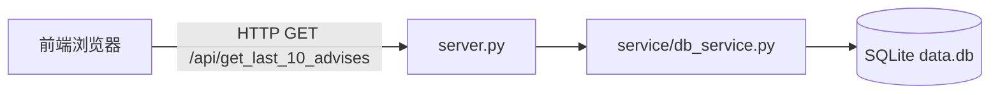

# 前端接口文档（v1）

## 概述
面向前端的 API 说明文档，覆盖「获取最新投资建议列表」的接口定义、字段说明、排序与错误处理。数据源来自本地 SQLite `data.db`，由上游流程写入。

## 基础信息
- Base URL：`http://127.0.0.1:8000`
- 鉴权：无（本地开发阶段）
- CORS：允许浏览器发起 GET 请求（返回 `Access-Control-Allow-Origin` 等必要头）
- 返回格式：`application/json; charset=utf-8`
- 追踪的固定代币集合（前端常量）：`USDT`, `BTC`, `ETH`, `USDC`, `SOL`, `XRP`, `ZEC`, `BNB`, `DOGE`

## 获取最新投资建议
- 方法与路径：`GET /api/get_last_10_advises`
- 说明：返回最近（按预测时间倒序）的最多 10 条投资建议。
- 请求参数：无

### 响应
- 成功：`200 OK`
  - 内容：JSON 数组，长度 `0..10`
  - 排序：按 `predicted_at`（UNIX 秒级时间戳）倒序；若相同或缺失，以插入时间/主键倒序保证稳定。
- 错误：`500 Internal Server Error`
  - 内容：`{ "error": "internal_error", "message": "..." }`

### 数据结构（每个数组元素）
- `symbol`：字符串。代币符号（如 `BTC`、`ETH`）。
- `advice_action`：字符串。建议操作（如 `buy`、`hold`、`sell`）。
- `advice_strength`：字符串。建议强度，枚举：`high` | `medium` | `low`。
- `reason`：字符串。简要原因说明，用于展示。
- `predicted_at`：整数。UNIX Epoch 秒级时间戳（如 `1732286100`）。
- `kline_24h`：对象或 `null`（可选）。若未实现/无数据，可返回 `null` 或省略。

> 备注：`kline_24h` 的结构当前非必需；若后续实现，建议提供标准 OHLCV 结构与时间戳，届时另行补充文档。

### 示例
请求：
```
GET http://127.0.0.1:8000/api/get_last_10_advises
Accept: application/json
```

成功响应（200）：
```json
[
  {
    "symbol": "BTC",
    "advice_action": "buy",
    "advice_strength": "high",
    "reason": "Momentum strong; derivatives funding neutral; positive dev activity",
    "predicted_at": 1732286100,
    "kline_24h": null
  },
  {
    "symbol": "ETH",
    "advice_action": "hold",
    "advice_strength": "medium",
    "reason": "Mixed on-chain flows; sentiment improving",
    "predicted_at": 1732283700,
    "kline_24h": null
  }
]
```

错误响应（500）：
```json
{
  "error": "internal_error",
  "message": "unexpected database error"
}
```

### 前端调用示例
使用 `fetch`（浏览器）：
```ts
type Advice = {
  symbol: string;
  advice_action: 'buy' | 'hold' | 'sell';
  advice_strength: 'high' | 'medium' | 'low';
  reason: string;
  predicted_at: number; // UNIX seconds
  kline_24h?: unknown | null;
};

async function loadLatestAdvices(): Promise<Advice[]> {
  const res = await fetch('http://127.0.0.1:8000/api/get_last_10_advises', {
    method: 'GET',
    headers: { 'Accept': 'application/json' },
    cache: 'no-store',
  });
  if (!res.ok) throw new Error(`HTTP ${res.status}`);
  const data = (await res.json()) as Advice[];
  // 已按 predicted_at 倒序；如需再次确保：
  data.sort((a, b) => b.predicted_at - a.predicted_at);
  return data;
}
```

使用 `curl`：
```
curl -s http://127.0.0.1:8000/api/get_last_10_advises | jq '.'
```

## 兼容性与注意事项
- 跨域：服务端返回必要的 CORS 头，允许浏览器发起 GET 请求。
- 空数据：当无记录时返回 `[]` 与 `200 OK`。
- 稳定排序：`predicted_at` 相同或缺失时，后端使用插入时间/主键倒序作为次序，前端无需额外处理。
- 扩展性：当前无查询参数（固定返回最多 10 条）；如需分页/筛选将另行更新文档。

---

# 后端技术设计（v1）

## 架构概述
本服务为轻量型后端，负责从本地 SQLite 数据库 `data.db` 读取最新的投资建议，并通过 `HTTP` 接口对外提供查询能力。遵循「代码写在 `server.py`，数据库的逻辑写在一个 `service` 模块里」的组织方式，确保职责清晰、便于维护与扩展。



## 技术栈与选择
- 语言：Python 3.12（与当前工程版本一致）
- Web 服务：建议使用标准库或轻量框架实现（例如 `http.server` / `Flask` / `FastAPI` 任一），当前以 `server.py` 作为入口与路由层。
- 数据库：SQLite（本地文件 `data.db`），通过 `sqlite3` 驱动访问。
- 模块化：将数据库访问封装在 `service/db_service.py` 中，服务层只负责业务查询与数据组装。

## 代码组织
- `server.py`
  - 职责：
    - 暴露 `GET /api/get_last_10_advises` 接口。
    - 处理 CORS 与错误响应（`500`）。
    - 调用 `db_service.get_last_10_advises()` 获取数据，进行 JSON 序列化返回。
  - 端口：`8000`（本地开发默认）。

- `service/db_service.py`
  - 职责：
    - 管理到 `data.db` 的连接（推荐使用只读连接或在查询时打开/关闭连接）。
    - 提供查询方法：`get_last_10_advises()`，按 `predicted_at DESC, id DESC` 排序，`LIMIT 10`。
    - 执行参数化查询，避免 SQL 注入与类型错误。
  - 返回结构：列表，每项为字典，字段包含 `symbol`、`advice_action`、`advice_strength`、`reason`、`predicted_at`（秒级时间戳）。

## 数据库设计
- 表：`advises`
  - 字段建议：
    - `id` INTEGER PRIMARY KEY AUTOINCREMENT
    - `symbol` TEXT NOT NULL
    - `advice_action` TEXT NOT NULL CHECK(advice_action IN ('buy','hold','sell'))
    - `advice_strength` TEXT NOT NULL CHECK(advice_strength IN ('high','medium','low'))
    - `reason` TEXT
    - `predicted_at` INTEGER NOT NULL  -- UNIX Epoch（秒）
    - `created_at` INTEGER NOT NULL DEFAULT (strftime('%s','now'))
  - 备注：若上游已定义表结构，以实际结构为准；此处提供最小可用与校验约束建议。

## 接口到数据库的映射流程
1. 前端发起 `GET /api/get_last_10_advises`。
2. `server.py` 路由接收请求，调用 `db_service.get_last_10_advises()`。
3. `db_service` 打开只读连接，执行：
   ```sql
   SELECT symbol, advice_action, advice_strength, reason, predicted_at
   FROM advises
   ORDER BY predicted_at DESC, id DESC
   LIMIT 10;
   ```
4. 将结果行转为字典列表，返回给 `server.py`。
5. `server.py` 封装 JSON 响应并写入 CORS 头；异常时返回 `500` 与错误信息。

## 错误处理与健壮性
- 数据库不可用/查询异常：记录日志，返回 `500` 和 `{ error, message }`。
- 空结果：返回 `[]` 与 `200 OK`。
- 类型与合法性：通过 `CHECK` 约束与应用层校验保证 `advice_action` 与 `advice_strength` 的枚举合法性；`predicted_at` 保持为整数秒。

## 安全与合规
- 当前无鉴权（本地开发）；如需上线建议增加 API key 或 JWT。
- CORS：仅在开发阶段开放 `Access-Control-Allow-Origin`；生产环境收敛到受信域名。
- SQL 注入：全部使用参数化查询（尽管此接口不接收查询参数，也保持统一做法）。

## 测试策略
- 单元测试（可选）：
  - `db_service.get_last_10_advises()`：在临时 SQLite 文件中创建 `advises` 表，插入样例数据，验证排序与返回结构。
- 集成测试：
  - 启动 `server.py`，使用 `curl` 访问接口，验证 `200`、空数据与异常路径。

## 运维与部署
- 启动：`python server.py`（或选择的框架启动方式）。
- 依赖：确保本地存在 `data.db` 文件；无则返回空数组。
- 端口占用：如 `8000` 被占用，可通过环境变量或配置切换端口。
